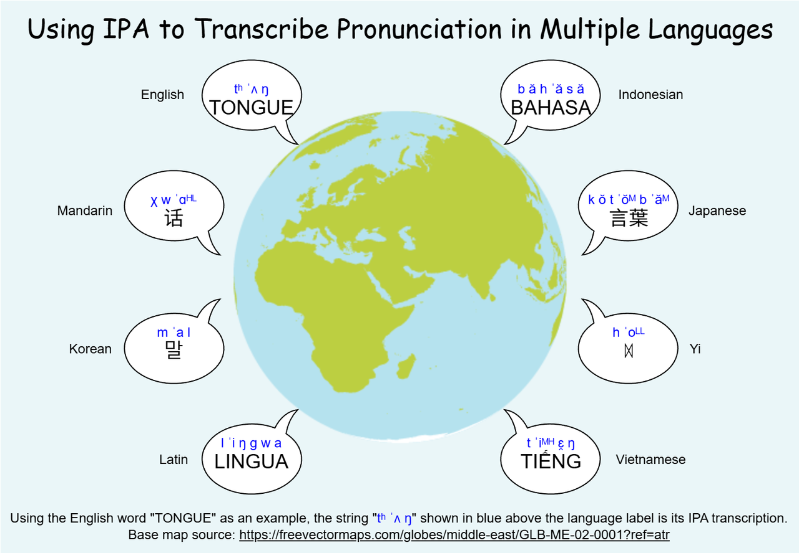
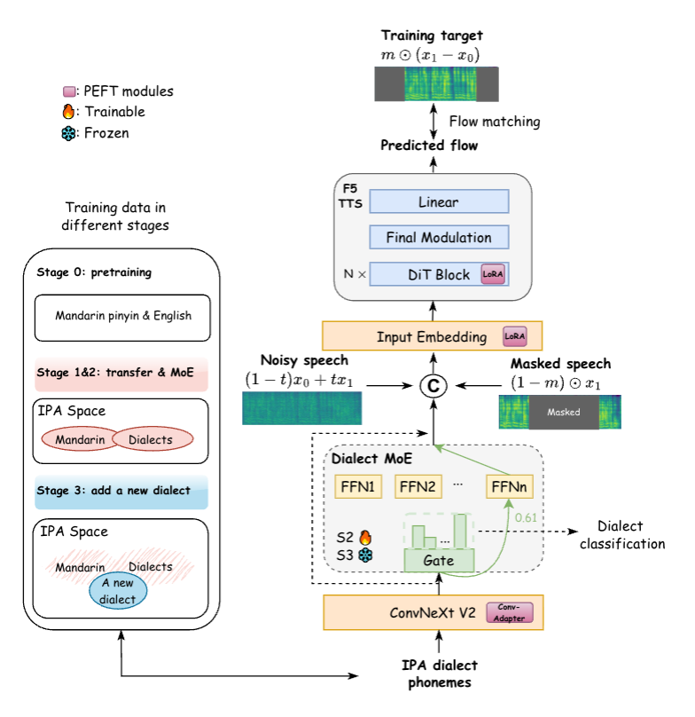

# DiaMoE-TTS: A Unified IPA-based Dialect TTS Framework with Mixture-of-Experts and Parameter-Efficient Zero-Shot Adaptation

---
<div align="center">

[](https://arxiv.org/abs/2509.22727)
[](https://huggingface.co/RICHARD12369/DiaMoE_TTS)

</div>

---
<p align="center">
  
</p>

## Overview ✨

This repository is designed to provide a comprehensive implementation for the series of research results of our unified dialect TTS. Specifically, this repository includes:

- 🧠 A modular **multi-dialect TTS framework** built on [**F5-TTS**](https://github.com/SWivid/F5-TTS).
- 🔤 A **unified IPA-based dialect frontend** for consistent cross-dialect phonetic representation.
- 🏋️ **Training & inference scripts** (CLI + config examples) for end-to-end reproduction.
- 🤗 **Hugging Face** checkpoints for easy access to pre-trained models.

Short Intro on [**DiaMoE-TTS**](https://arxiv.org/abs/2509.22727):

Dialect speech embodies rich cultural and linguistic diversity, yet building text-to-speech (TTS) systems for dialects remains challenging due to scarce data, inconsistent orthographies, and complex phonetic variation. To address these issues, we present DiaMoE-TTS, a unified IPA-based framework that standardizes phonetic representations and resolves grapheme-to-phoneme ambiguities. Built upon the F5-TTS architecture, the system introduces a dialect-aware Mixture-of-Experts (MoE) to model phonological differences and employs parameter-efficient adaptation with Low-Rank Adaptors (LoRA) and Conditioning Adapters for rapid transfer to new dialects. Unlike approaches dependent on large-scale or proprietary resources, DiaMoE-TTS enables scalable, open-data-driven synthesis. Experiments demonstrate natural and expressive speech generation, achieving zero-shot performance on unseen dialects and specialized domains such as Peking Opera with only a few hours of data.

<p align="center">
  
</p>


The International Phonetic Alphabet (IPA) is the most widely used phonetic annotation system in the investigation and study of Chinese dialects. The vast majority of Chinese dialect corpora, including homophone tables, dictionaries and texts, utilize the IPA for phonetic transcription. The phonetic annotation system for this project is based on the IPA. It constructs a highly scalable phoneme inventory (currently containing 442 units) from a base of 100+ IPA phoneme symbols. This system is designed to support the phonetic annotation of all known Chinese dialects and is also extensible to European languages. (It currently supports 11 dialects and Mandarin; its validity has also been verified for English, French, German and the Bildts dialect of Dutch).


Regarding the construction details of the IPA dialect frontend system, please refer to:  

- [📄 中文版说明 (Chinese version)](./docs/ipa_frontend_CN.md)  
- [📄 English version](./docs/ipa_frontend_EN.md)  


---

## News & Updates 🗞️
- **🚀[2025-09-21]** Initial public release of codebase.
- **🔥[2025-09-25]** Release checkpoints on 🤗 **Hugging Face**
- **📦[2025-09-25]** Release training datasets
- **📄[2025-10-05]** Update our paper on arXiv
- **🧠[2025-10-08]** Release gradio app for quick start！

---

## Installation 🛠️
```bash
# clone code
git clone https://github.com/GiantAILab/DiaMoE-TTS.git
cd DiaMoE-TTS

# conda environment
conda create -n diamoetts python=3.10
conda activate diamoetts
cd diamoe_tts
pip install -e .
```

---

## Quick Start 🚀

### Training
```bash
cd diamoe_tts
accelerate launch --config_file default_config.yaml \
  src/f5_tts/train/train.py \
  --config-name diamoetts.yaml
```
### Inference
```bash
bash ./src/f5_tts/infer/batch_infer.sh
```
See [diamoe_tts](./diamoe_tts/README.md) for more details.

### IPA Frontend
```bash
cd dialect_frontend
bash single_frontend.sh 1-6 <dialect_name> <input_file.txt>
```
See [ipa_frontend](./dialect_frontend/README.md) for more details.

---

## Datasets 📚
> We utilize the [Common Voice Cantonese dataset](https://arxiv.org/abs/1912.06670), the [Emilia Mandarin dataset](https://arxiv.org/abs/2407.05361) and dialectal data     
> from the [KeSpeech corpus](https://openreview.net/forum?id=b3Zoeq2sCLq) and a open-source [Sourthern Min dataset](https://sutian.moe.edu.tw/zh-hant/siongkuantsuguan/) for training.  
> We release the frontend of the [🤗open-source dataset IPA](https://huggingface.co/datasets/RICHARD12369/DiaMoE-TTS_IPA_Trainingset)
---

## Pretrained Models 🧪
|               Model               |                                                                       🤗 Hugging Face                                                                        | 👷 Status |
|:---------------------------------:|:------------------------------------------------------------------------------------------------------------------------------------------------------------:|:------:|
|    **🚀 MLPexpert_base_model**    |         [](https://huggingface.co/RICHARD12369/DiaMoE_TTS/blob/main/10ep_mlpEXP_9.pt)         | ✅ |
| **🚀 yunbai(Peking Opera)_lora**  |   [](https://huggingface.co/RICHARD12369/DiaMoE_TTS/blob/main/10ep_mlpEXP_9_jjyb_lora.pt)   | ✅ |
| **🚀 jingbai(Peking Opera)_lora** |  [](https://huggingface.co/RICHARD12369/DiaMoE_TTS/blob/main/10ep_mlpEXP_9_jjjb_lora.pt)   | ✅ |
|        **🚀 nanjing_lora**        | [](https://huggingface.co/RICHARD12369/DiaMoE_TTS/blob/main/10ep_mlpEXP_9_nanjing_lora.pt) | ✅ |
---

## Development Roadmap & TODO 🗺️
- [x] release code for train/infer
- [x] release code for IPA frontend
- [x] release our checkpoints
- [x] release open-source training dataset IPA frontend
- [x] develop gradio app for DiaMoE-TTS


[//]: # (---)

[//]: # ()
[//]: # (## Citation 🧾)

[//]: # (> **TBD:** BibTeX entries for DiaMoE‑TTS &#40;and related papers, if any&#41;.)

---

## Acknowledgements 🙏
- Thanks to all contributors and community members who helped improve this project.
- This work builds upon [F5-TTS](https://github.com/SWivid/F5-TTS) and related research.
- Our frontend uses [PaddleSpeech](https://github.com/PaddlePaddle/PaddleSpeech) to obtain Mandarin pinyin first.

---

## License 📝
Our code is released under MIT License.


## Star 🌟 History

[](https://www.star-history.com/#GiantAILab/DiaMoE-TTS&type=date&legend=top-left)

## 📚 Citation

If you find our model helpful, please consider citing our projects 📝 and staring us ⭐️！

```bib
@article{chen2025diamoe,
  title={DiaMoE-TTS: A Unified IPA-Based Dialect TTS Framework with Mixture-of-Experts and Parameter-Efficient Zero-Shot Adaptation},
  author={Chen, Ziqi and Chen, Gongyu and Wang, Yihua and Ding, Chaofan and Zhang, Wei-Qiang and others},
  journal={arXiv preprint arXiv:2509.22727},
  year={2025}
}
```
