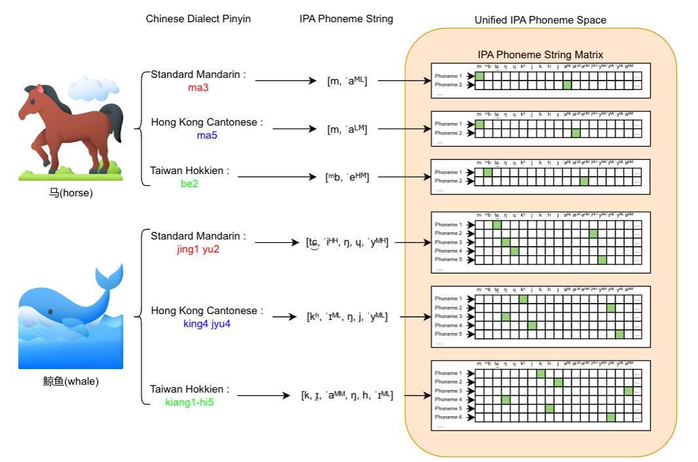

# IPA Chinese Dialect Frontend Processing System

A comprehensive frontend processing system for Chinese dialects, supporting phonological conversion, tone sandhi, and IPA transcription for multiple Chinese dialect varieties.

## Overview

This system processes Chinese text through a multi-step pipeline to generate accurate phonological representations for various Chinese dialects. It handles everything from character-to-pinyin mapping to complex tone sandhi rules and IPA transcription.

<p align="center">
  
</p>

## Supported Dialects

- **Mandarin varieties**: `putonghua`, `shijiazhuang`, `zhengzhou`, `nanjing`, `wuhan`, `xian`, `chengdu`, `qingdao`
- **Wu dialects**: `shanghai`
- **Min dialects**: `gaoxiong` 
- **Peking Opera Pronunciations**: `jingjujingbai`, `jingjuyunbai`

## Processing Pipeline

The system processes input text through 6 sequential steps:

### Step 0: Get Frontend in Mandarin Pinyin
- Obtain the corresponding Mandarin pinyin of the text frontend
- **Script**: `gen_ppinyin_oop.py`
- **🛠️using our g2pw** : [](https://huggingface.co/RICHARD12369/DiaMoE_TTS/blob/main/g2pw.tar.gz)

### Step 1: Fix Erhua in Mandarin Frontend
- Handles retroflex suffix (儿化音) correction in Mandarin pinyin
- Skipped for Putonghua dialect
- **Script**: `fix_erhua.py`

### Step 2: Map Chinese Characters to Dialect Pinyin
- Converts Chinese characters to dialect-specific pinyin representations
- Uses character-level mapping tables for each dialect
- **Script**: `hanzi2dialect_pinyin.py`

### Step 3: Supplement Word Mapping to Dialect Pinyin
- Applies word-level pinyin replacements for better accuracy
- Handles multi-character words and phrases
- **Script**: `word2dialect_pinyin.py`

### Step 4: Tone Sandhi
- Applies dialect-specific tone change rules
- **Important**: For certain dialects (Shanghai, Min varieties), tone sandhi boundary prediction is crucial for accurate results
- Supports both sequence-based and character-specific tone rules
- **Script**: `liandu_tone.py`

### Step 5: Pinyin to IPA
- Converts dialect pinyin to International Phonetic Alphabet (IPA)
- Uses dialect-specific syllable mapping tables
- **Script**: `pinyin2ipa.py`

### Step 6: IPA Tone Symbol Mapping
- Maps tone contours to appropriate IPA tone symbols
- Final step in the phonological processing pipeline
- **Script**: `ipa_tone.py`

## Usage

### Single File Processing

Process a single text file through all steps:

```bash
bash single_frontend.sh 1-6 <dialect_name> <input_file.txt>
```

**Examples:**
```bash
# Process Shanghai dialect
bash single_frontend.sh 1-6 shanghai input_text.txt

# Process specific steps only
bash single_frontend.sh 2-4 chengdu input_text.txt

# Process all steps
bash single_frontend.sh all putonghua input_text.txt
```

### Input Format

Input files should be tab-separated with the following format:
```
<utterance_id>	<chinese_text>	[existing_pinyin]
```

Example:
```
utt001	今天天气很好。
utt002	我喜欢学习中文。
```

### Output Files

The system generates intermediate and final output files:
- `*_fix_pinyin.txt` - After erhua fixing
- `*_hanzi.txt` - After character mapping
- `*_word.txt` - After word-level mapping
- `*_liandutone.txt` - After tone sandhi
- `*_ipa1.txt` - After IPA conversion
- `*_ipa_format.txt` - Final output with tone symbols

## Directory Structure

```
dialect_frontend/
├── single_frontend.sh          # Main processing script
├── fix_erhua.py               # Step 1: Erhua fixing
├── word2dialect_pinyin.py     # Step 3: Word mapping
├── liandu_tone.py            # Step 4: Tone sandhi
├── pinyin2ipa.py             # Step 5: Pinyin to IPA
├── ipa_tone.py               # Step 6: IPA tone mapping
├── gen_ppinyin_oop.py        # Utility: Generate standard pinyin
└── frontend/
    └── dialect/
        ├── putonghua/        # Standard Mandarin data
        ├── shanghai/         # Shanghai Wu data
        ├── chengdu/          # Chengdu dialect data
        └── ...               # Other dialect data
```

## Configuration Files

Each dialect directory contains:
- `syllable.xlsx` / `base_syllable.xlsx` - Pinyin to IPA mapping
- `tone.xlsx` / `base_tone.xlsx` - Tone contour to symbol mapping
- `word.xlsx` / `base_word.xlsx` - Word-level pinyin mappings
- `hanzi.xlsx` - Character-level mappings (some dialects)

## Advanced Features (to do...)

### Tone Sandhi Boundary Prediction

For complex tone sandhi systems (Shanghai Wu, Min dialects), the system supports:
- Automatic prosodic boundary detection
- Context-sensitive tone sandhi application  
- Multi-level tone change rules

**Note**: Shanghai and Min dialects require careful tone sandhi boundary prediction before applying tone rules for optimal accuracy.


